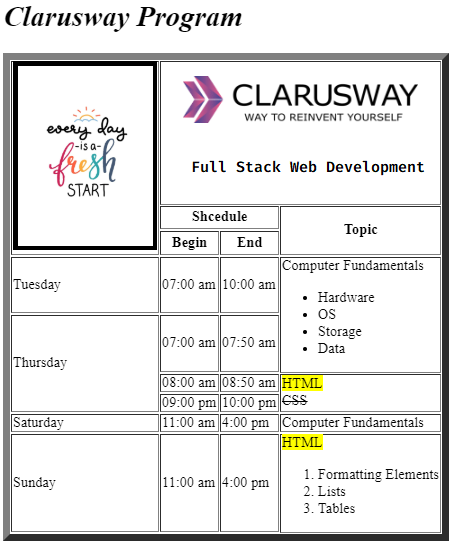

Clarusway

# HC-CC-01 : HTML Basic Table

Purpose of the this coding challenge is to learn HTML basics.

## Learning Outcomes

At the end of the this coding challenge, students will be able to;

- create a table,
- add images,
- add headings, sub-headings and paragraphs,
- use HTML formatting elements,
- use ordered and unordered lists.

## Problem Statement

- Write a code that creates an html time scheduler.
- Push your code on a github repository with a README.md file

## Additional Resourses

- [Link of image](https://data.whicdn.com/images/305761013/original.jpg)
- [Link of Clarusway Logo](https://drive.google.com/file/d/1fq096fVXmhzcmrvrG99lLTfavgggNu4m/view?usp=sharing)

 

 ⌛ Happy Coding  ✍ 

