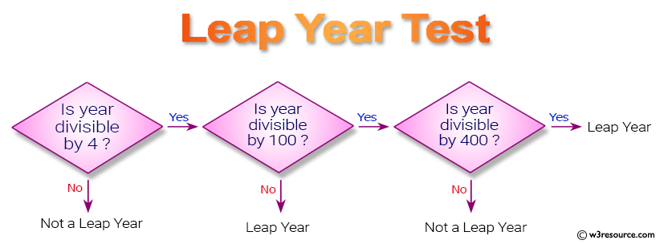
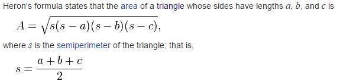
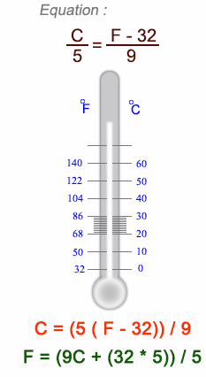

<p>Clarusway</p>

# JS-CC-01 : Operators

Purpose of the this coding challenge is to practice on JS operators

## Learning Outcomes

At the end of the this coding challenge, students will be able to;

- analyze a problem, identify and apply programming knowledge for appropriate solution.

- demonstrate their knowledge of algorithmic design principles by using JavaScript effectively.

## Problem Statement

1. What is the output?

   ```js
   console.log(2 && 3)
   console.log(2 || 3)
   
   let a;
   let b = a || 22
   console.log(b)
   
   console.log(a && "Text")
   a = 10
   console.log(a && "Text")
   ```

   

   

2. Write a JavaScript program to determine a year is a leap year in the Gregorian calendar. 

   (Please search the conditions for the leap year) <br>

   

3. Write a JavaScript code to find the area of a triangle. <br>

   

4. Write a JavaScript program to convert temperatures to and from Celsius, Fahrenheit <br>

   

<center> ⌛ Happy Coding  ✍ </center>